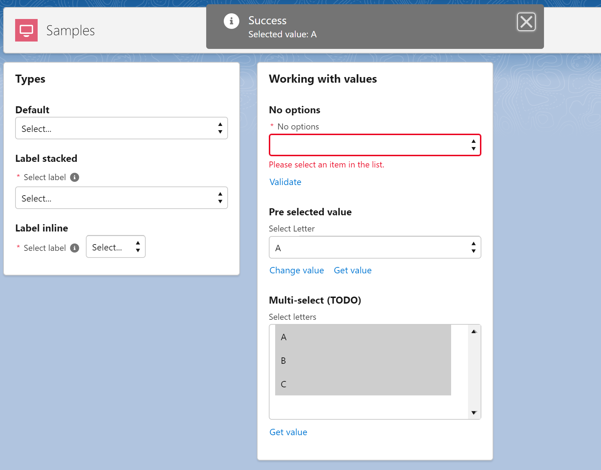

# LWC Select (ALPHA)



## About

Generic select component since lightning combobox has limitations on mobile/overflow elements

## Features
- Native SLDS Style
- Support all the SLDS variants
- Integrated on a single component (easy to copy to multiple projects)
- Multi-select
- Native validation with browser error message (localized)


## Instructions

### Use on your project
Everything was developed in a single LWC, so you just need a new single component on your project.

- Copy the following files to your project:
    - force-app/main/default/lwc/lwcSelect/**
- Call the component and pass the options
```
<c-lwc-select variant="label-stacked" required label="Select label" options={options1}
                        field-level-help="Label stacked" data-selector="type-stacked"></c-lwc-select>
```

### Testing and learn how to use it

- Run the `createorg.sh` to create a scratch org
- Open the `LWC Select` lightning app
- Explore the code on the `samples` component
- Edit the page to preview on mobile devices or login with your mobile device (check the `password.env` file)


## References

https://www.lightningdesignsystem.com/components/select/#site-main-content

https://www.lightningdesignsystem.com/components/combobox/

https://developer.salesforce.com/docs/component-library/bundle/lightning-combobox/example